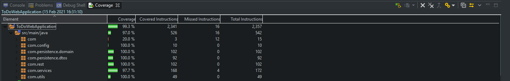

# ToDoWebApplication

Coverage: 97.0%



Description: A web application that allows users to add different to do's/ tasks to a list.

[Jira board](https://auraihqa.atlassian.net/jira/software/c/projects/TDWA/issues/)

[GitHub](https://github.com/AUraihQA/ToDoWebApplication)


## Getting Started

These instructions will get you a copy of the project up and running on your local machine for development and testing purposes. See deployment for notes on how to deploy the project on a live system.

### Prerequisites

[Maven](https://maven.apache.org/index.html) 

[Github](https://github.com/)

[Git](https://git-scm.com/downloads)

[Spring Boot](https://spring.io/tools)

[Chromedriver](https://chromedriver.storage.googleapis.com/index.html) - you will need to get the version of your chrome click the options button in the top right hand corner(3 dots) and then select Help and then About Chrome. 
This will show you the version of chrome you are on and you can download the [driver](https://chromedriver.storage.googleapis.com/index.html) that relates to the version of chrome you have. 
You will need to create a folder in 'src/main/resources' called 'drivers' and another folder in the drivers folder called 'chrome'. Once you have downloaded the chrome driver, you will need to extract the file and ensure it is named 'chromedriver.exe'.
The file 'chrome' is where you will insert the chromedriver.exe file you have downloaded using the [link](https://chromedriver.storage.googleapis.com/index.html)

### Installing

A step by step series of examples that tell you how to get a development env running


```
Step 1 - Fork this repository and clone it using git on your local machine
Step 2 - Import the folder into your IDE

```

### Unit Tests 

Unit tests are when individual units or components of the software that are tested. This validates that each unit of the software code functions as expected

The unit tests in this project are:

```
ListServiceUnitTest
ToDoServiceUnitTest
```

### Integration Tests 
Integration tests are when individual software modules are tested as one. Integration testing were done to ensure that all the classes are working together. It has been test from the highest level

The integration tests in this project are:

```
ListControllerIntegrationTest
ToDoControleerIntegrationTest
```

### Acceptance Testing

Acceptance tests, test the user requirements. These tests were done against the acceptance criteria on the user stories, which can be found on the [jira board](https://auraihqa.atlassian.net/jira/software/c/projects/TDWA/issues/)

The acceptance tests in this project were:

```
IndexPage.java
ListPage.java
ToDoPage.java
```

## Deployment

```
Step 1 - Go into the folder
Step 2 - Navigate your way into the target folder
Step 3 - Once in the folder Right click and open git bash
Step 4 - type "java -jar ToDoWebApplication-0.0.1-SNAPSHOT.jar"
Step 5 - once you've entered the input, you will be able to go to your browser and type "localhost:8080" and this will show the web application 
```

## Built With

* [Maven](https://maven.apache.org/) - Dependency Management


## Authors

[Adigwe Uraih](https://github.com/AUraihQA)

## License

This project is licensed under the MIT license - see the [LICENSE.md](LICENSE.md) file for details 

*For help in [Choosing a license](https://choosealicense.com/)*

## Acknowledgments

* [Vinesh Ghela](https://github.com/vineshghela) and [Aswene Sivaraj](https://github.com/Asivaraj-QA) - Java
* [Nicholas Johnson](https://github.com/nickrstewarttds) - Github
* [Savannah Vaithilingam](https://github.com/savannahvaith) - JavaScript, HTML
* [Alan Davis](https://github.com/MorickClive) - Springboot
* [JHarry444](https://github.com/JHarry444) - myBeansUtils
